## Table of Contents
- [Overview](#overview)
- [Deployment](#deployment)
- [User Guide](#user-guide)
- [Community Feedback](#community-feedback)
- [Developer Guide](#developer-guide)
- [Initialization](#initialization)
- [Quality Assurance](#quality-assurance) 
- [Continuous Integration](#continuous-integration) 
- [Development History](#development-history)

<br>

## Overview
There isn’t a dedicated website for University of Hawaii specific reviews. For example, [ratemyprofessors.com](https://www.ratemyprofessors.com/) doesn’t come off as personalized or “peer reviewed” because it doesn’t have profiles of people.

In response to this, we're creating an interactive website to rate events and professors, but only for UH Manoa students. This application illustrates various technologies, include:

- [Meteor](https://www.meteor.com/) for Javascript-based implementation of client and server code.
- [React](https://reactjs.org/) for component-based UI implementation and routing.
- [Semantic UI React](https://react.semantic-ui.com/) CSS Framework for UI design.

<br>

## Deployment
A live deployment of Rate My Classes can be found at [https://ratemyclassesmanoa.club](https://ratemyclassesmanoa.club).

<br>

## User Guide
This section provides a walkthrough of the Rate My Classes Manoa user interface and its capabilities.


### Landing Page
The landing page is the first thing the users see upon visiting the root URL to the site.


<br>

### Sign In and Sign Up

Click on the "Get Started" button in upper right corner of the navbar, then select "Sign In" to go to the following page to log in. You must have been previously registered with the system to use this option:

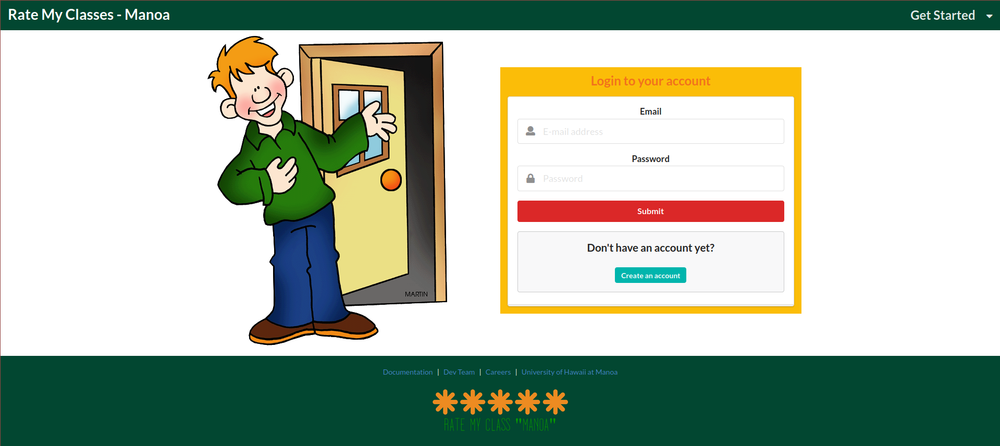

<br>
<br>

Alternatively, you can select “Sign Up” to go to the following page and register as a new user. User input will reflect on their profile page after signing in:

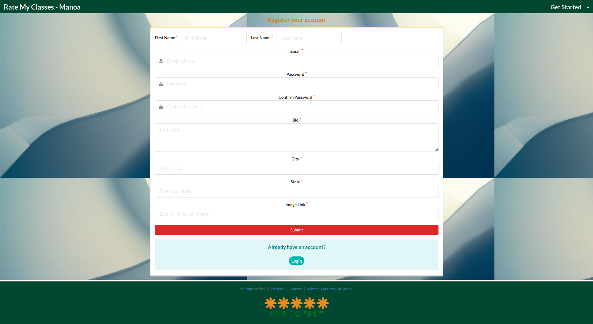

<br>

### Profile Page

Once logged in, you will be taken to your profile page. Here you can see the class and professor reviews that you have submitted - both posted reviews and reviews waiting to be approved by the Administrator.

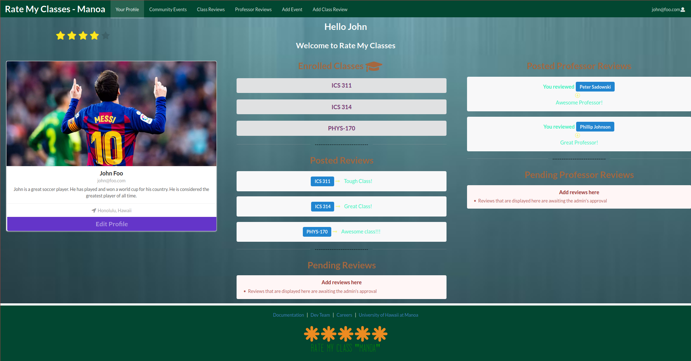
<br>
<br>

To update your profile information, click on the "Edit Profile" button. This will bring you to this page. Here you can use the form to make the necessary changes.

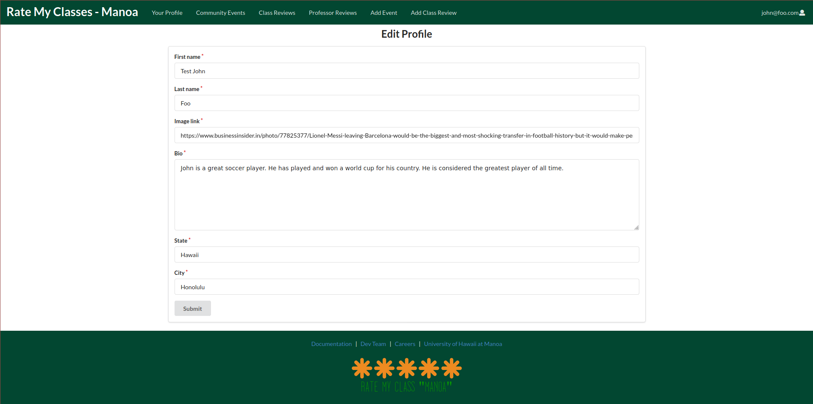

<br>


### Class Review Page

Click on the "Class Reviews" tab to view the class reviews. Use the dropdown panel to pick the class for which you would like to see reviews.

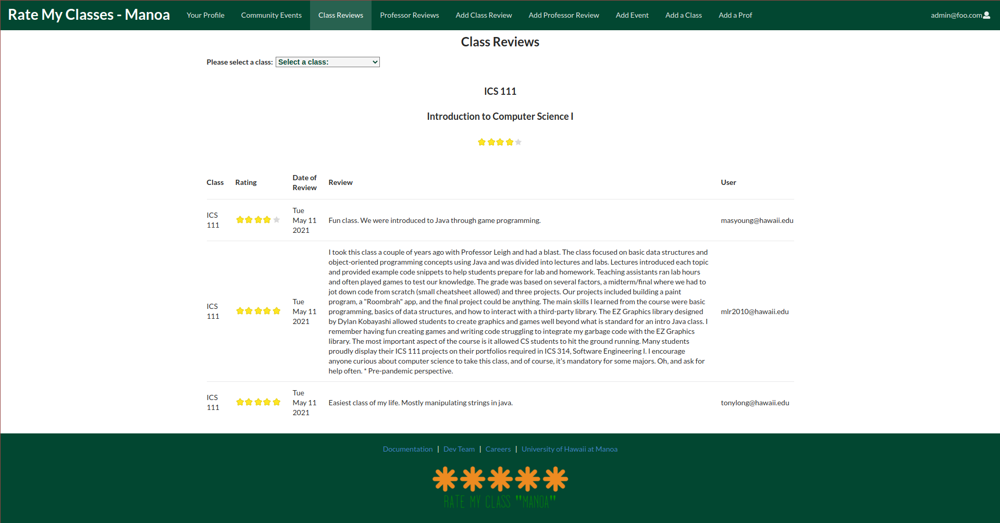

<br>

### Add Class Review Page

To add a class review, click on the "Add Class Review" tab. Completely fill out the form and then click "Submit." All reviews must be approved by the Administrator before they appear on the website.

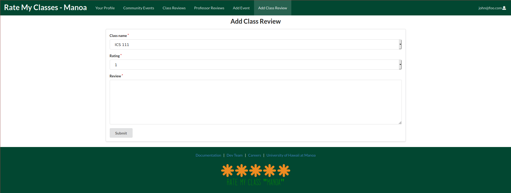

<br>

### Accept/Deny a Class Review (Admin)

If logged in as an Administrator, in the Administrator home page, there is a "Pending Reviews" section. In this section, you can choose to accept or delete any pending class reviews. Accepted reviews will appear on the "Class Reviews" page for all users to view.

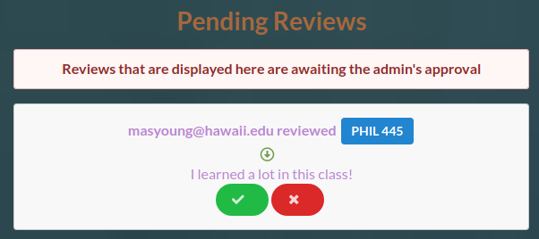

<br>

### Add a Class Page (Admin)

If logged in as an Administrator, you can click the "Add a Class" tab to add another class to the database. Completely fill out the form and then click "Submit."

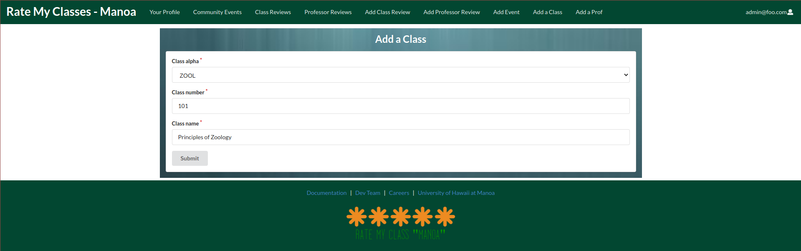

<br>

### Professor Review Page

Click on the "Professor Reviews" tab to view the Professor reviews. Use the dropdown panel to pick the Professor for whom you would like to see reviews.

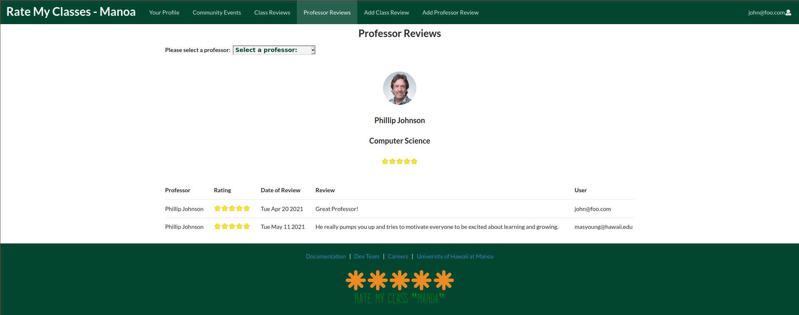

<br>

### Accept/Deny a Professor Review (Admin)

If logged in as an Administrator, in the Administrator home page, there is a "Pending Professor Reviews" section. In this section, you can choose to accept or delete any pending Professor reviews. Accepted reviews will appear on the "Professor Reviews" page for all users to view.

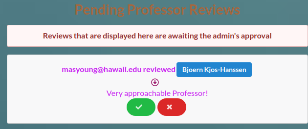

<br>

### Add Professor Review Page

To add a Professor review, click on the "Add Professor Review" tab. Completely fill out the form and then click "Submit."

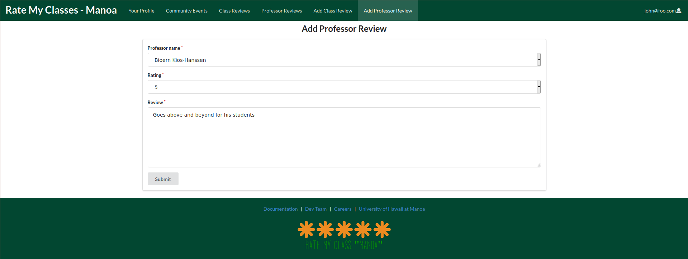

<br>

### Add a Professor Page (Admin)

If logged in as an Administrator, you can click the "Add a Prof" tab to add another Professor to the database. Completely fill out the form and then click "Submit."

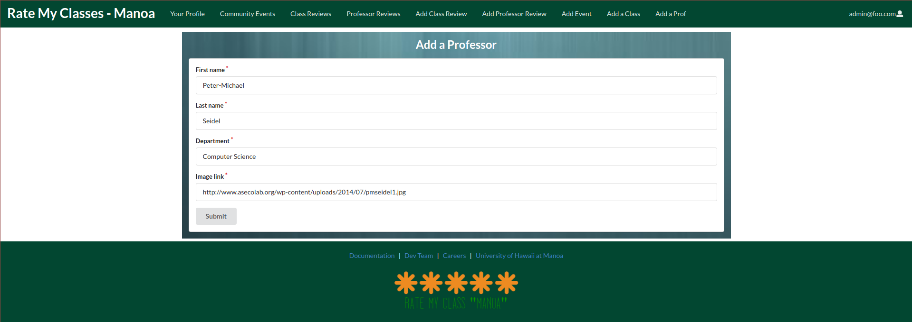

<br>

### Community Events Page

To find out what things are happening at UH Manoa, click on the "Community Events" tab.

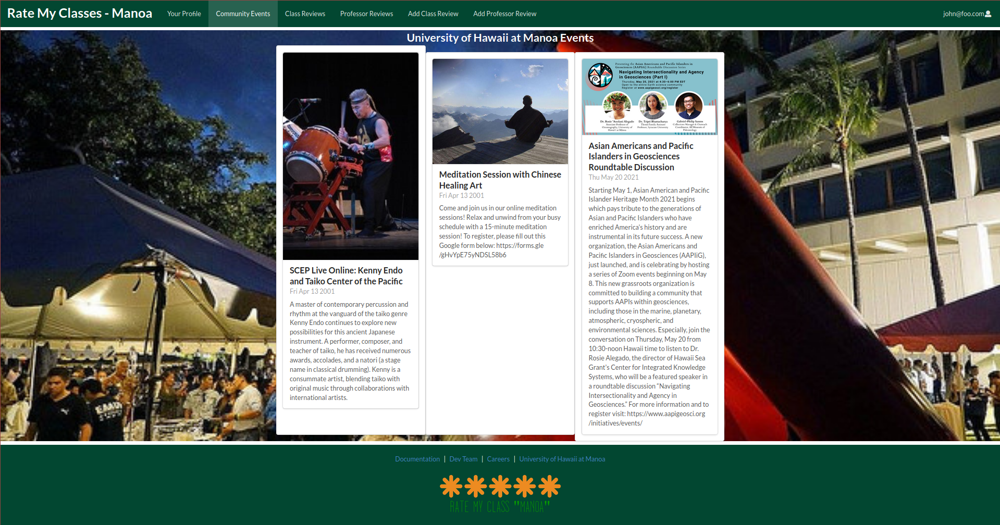

<br>

### Add Event Page (Admin)

If logged in as an Administrator, you can click the "Add Event" tab to add another event to the database. Completely fill out the form and then click "Submit."

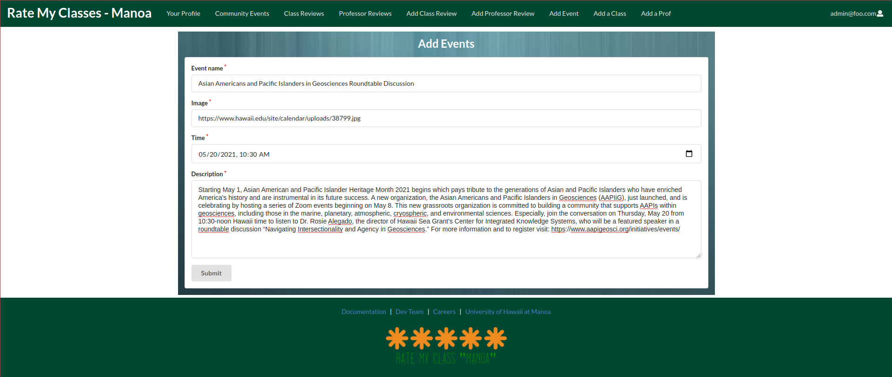

<br>

### Meet the Team Page

In the footer of every page, you can click on the "Dev Team" link. This will take you to the following page:


<br>
<br>

You can click on a name, then a brief description about that person will appear.

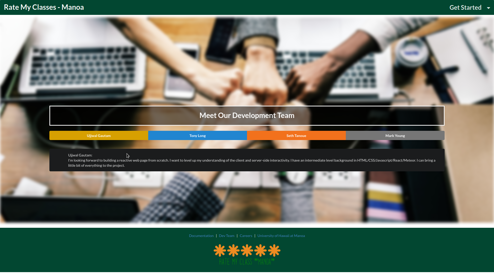

<br>

### Careers Page

Also in the footer of each page is the "Careers" link. This will take you to the following page, where you can learn a little about working for Rate My Classes Manoa and view current job openings.

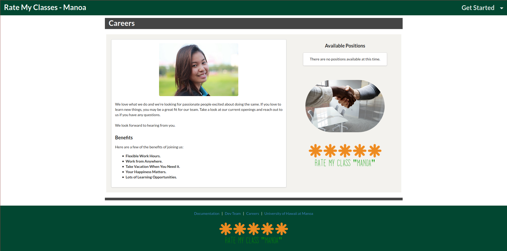

<br>
<br>

## Community Feedback

We are interested in your experience using Rate My Classes! If you would like, please take a couple of minutes to fill out the [Rate My Classes Feedback Form](https://docs.google.com/forms/d/e/1FAIpQLSeVeaA6BbtIEhH--atN_EEg4dQoA27bt7Rgz3st0ZLUwLmciA/viewform?usp=sf_link). It contains only five short questions and will help us understand how to improve the system.

Here are what some users are saying:
* "Easy navigation, but I don't like that I need to upload a picture to sign up for an account."
* "I like the site...very in tune with Manoa. I think the search mechanism can be improved."
* "I really like this app! I don't like that the 'Add Class Review' and 'Add Professor Review' pages are separate from the 'Class Reviews' and 'Professor Reviews' pages."

<br>

## Developer Guide

This section provides information of interest to Meteor developers wishing to use this code base as a basis for their own development tasks.

### Installation

First, [install Meteor](https://www.meteor.com/developers/install).

Second, visit the [Rate My Classes github page](https://github.com/Rate-My-Classes-Manoa/rate-my-classes), and click the “Use this template” button to create your own repository initialized with a copy of this application. Alternatively, you can download the sources as a zip file or make a fork of the repo. However you do it, download a copy of the repo to your local computer.

Third, cd into the `rate-my-classes/app` directory and install libraries with:

```
meteor npm install
```

Fourth, run the system with:

```
meteor npm run start
```

If all goes well, the application will appear at [http://localhost:3000](http://localhost:3000).

### Application Design

Rate My Classes is based upon [meteor-application-template-react](https://ics-software-engineering.github.io/meteor-application-template-react/). Please use the videos and documentation at that site to better acquaint yourself with the basic application design of Rate My Classes.

### Data Model

The main data model of RateMyClasses consist of three collections (Professor, Classes, and Profile). The Professor and Classes collections interact with each other though the "join" collection Classes/Professor. The Profile and Classes collection interact with each other though the "join" collection Profile/Classes.


The fields in bold are the primary keys that join each collection.

<br>

## Initialization

The [config](https://github.com/Rate-My-Classes-Manoa/rate-my-classes/blob/master/config) directory is intended to hold settings files.  The directory contains one file: [settings.development.json](https://github.com/Rate-My-Classes-Manoa/rate-my-classes/blob/master/config/settings.development.json).

This file contains default definitions for Classes, Events, Professors, and Profiles and the relationships between them. 

## Quality Assurance

### ESLint

Rate My Classes Manoa includes a [.eslintrc](https://github.com/Rate-My-Classes-Manoa/rate-my-classes/blob/master/app/.eslintrc) file to define the coding style adhered to in this application. You can invoke ESLint from the command line as follows:

```
meteor npm run lint
```

ESLint should run without generating any errors.

### End to End Testing

Rate My Classes uses [TestCafe](https://devexpress.github.io/testcafe/) to provide automated end-to-end testing.

The Rate My Classes Manoa end-to-end test code employs the page object model design pattern.  In the [rate-my-class/app/tests](https://github.com/Rate-My-Classes-Manoa/rate-my-classes/tree/master/app/tests) directory, the file [tests.testcafe.js](https://github.com/Rate-My-Classes-Manoa/rate-my-classes/blob/master/app/tests/tests.testcafe.js) contains the TestCafe test definitions. The remaining files in the directory contain "page object models" for the various pages in the system. This organization makes the test code shorter, easier to understand, and easier to debug.

To run the end-to-end tests in development mode, you must first start up a Rate My Classes instance by invoking `meteor npm run start` in one console window.

Then, in another console window, start up the end-to-end tests with:

```
meteor npm run testcafe
```

You can also run the testcafe tests in "continuous integration mode".  This mode is appropriate when you want to run the tests using a continuous integration service like Jenkins, Semaphore, CircleCI, etc.  In this case, it is problematic to already have the server running in a separate console, and you cannot have the browser window appear and disappear.

To run the testcafe tests in continuous integration mode, first ensure that Rate My Classes is not running in any console.

Then, invoke `meteor npm run testcafe-ci`.  

<br>

## Continuous Integration


Rate My Classes uses [GitHub Actions](https://docs.github.com/en/free-pro-team@latest/actions) to automatically run ESLint and TestCafe each time a commit is made to the default branch. Click [here](https://github.com/Rate-My-Classes-Manoa/rate-my-classes/actions) to see the results of all recent <em>workflows</em>. 

The workflow definition can be viewed in the [.github/workflows/ci.yml](https://github.com/Rate-My-Classes-Manoa/rate-my-classes/blob/master/.github/workflows/ci.yml) file.

<br>

## Development History

The development process for Rate My Classes conformed to [Issue Driven Project Management](http://courses.ics.hawaii.edu/ics314f19/morea/project-management/reading-guidelines-idpm.html) practices. These practices can be summed up as follows:

- Development consists of a sequence of Milestones.

- Each Milestone is specified as a set of tasks.
 
- Each task is described using a GitHub Issue, and is assigned to a single developer to complete.
  
- Tasks should typically consist of work that can be completed in 2-4 days.
   
- The work for each task is accomplished with a git branch named “issue-XX”, where XX is replaced by the issue number.
  
- When a task is complete, its corresponding issue is closed and its corresponding git branch is merged into master.
  
- The state (todo, in progress, complete) of each task for a milestone is managed using a GitHub Project Board.

The following sections document the development history of Rate My Classes.

### Milestone 1: Deploy and Mockup Development

The goal of Milestone 1 was to 
- Deploy the system to [Digital Ocean](https://www.digitalocean.com/),
- Create a landing page, and
- Create mockups for at least four other pages.

Milestone 1 was managed using the [rate-my-classes GitHub Project Board M1](https://github.com/Rate-My-Classes-Manoa/rate-my-classes/projects/1):

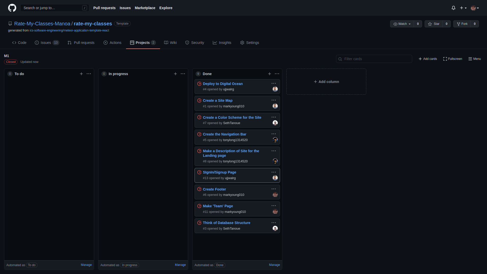

<br>

### Milestone 2: Great Improvements

The goal of Milestone 2 was to

- Significantly improve the functionality and quality of the application beyond M1, and
- Significantly improve the software engineering process beyond M1.

Milestone 2 was managed using the [rate-my-classes GitHub Project Board M2](https://github.com/Rate-My-Classes-Manoa/rate-my-classes/projects/2):

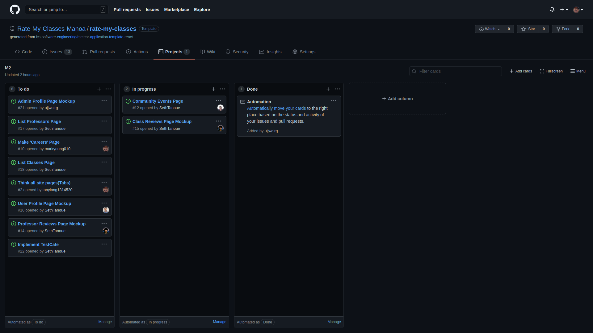

<br>

### Milestone 3: Potentially Finish

The goal of Milestone 3 was to

- Significantly improve the functionality of the system from Milestone M2. 
- Find at least five UH community members to try out the system and provide feedback.
- Implement acceptance testing.

Milestone 3 was managed using the [rate-my-classes GitHub Project Board M3](https://github.com/Rate-My-Classes-Manoa/rate-my-classes/projects/3):

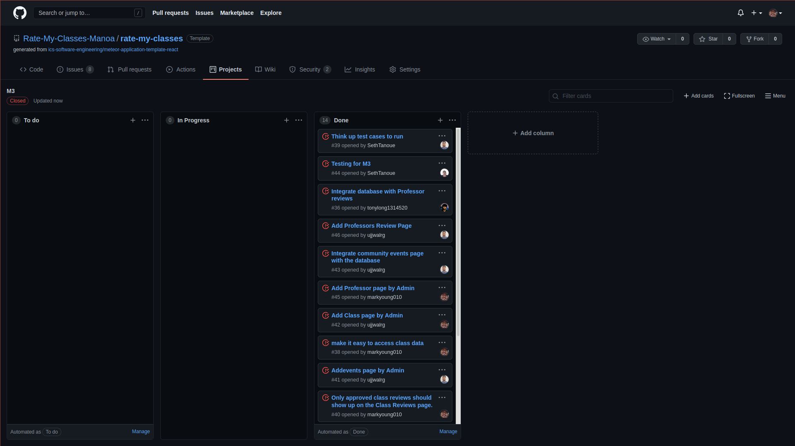

<br>

## Contact Us

Rate My Classes is designed, implemented, and maintained by [Ujjwal Gautam](mailto:ugautam@hawaii.edu), Tony Long, Seth Tanoue, and [Mark Young](mailto:masyoung@hawaii.edu).

<br><br><br><br>
