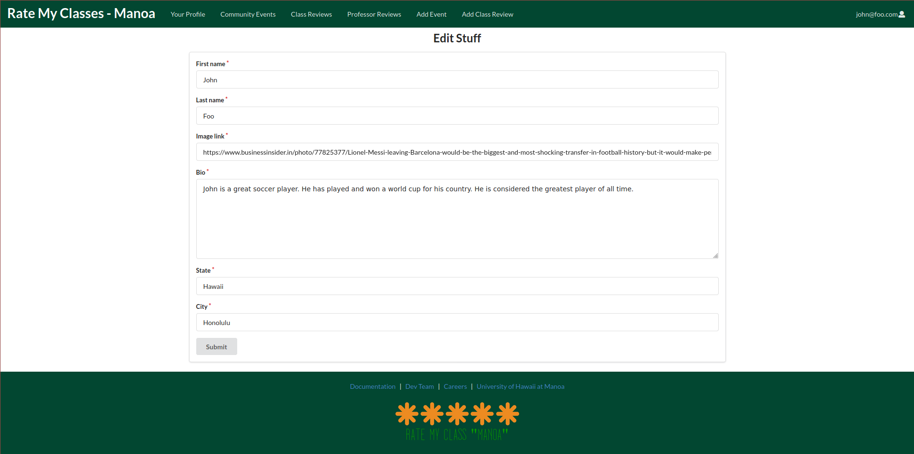
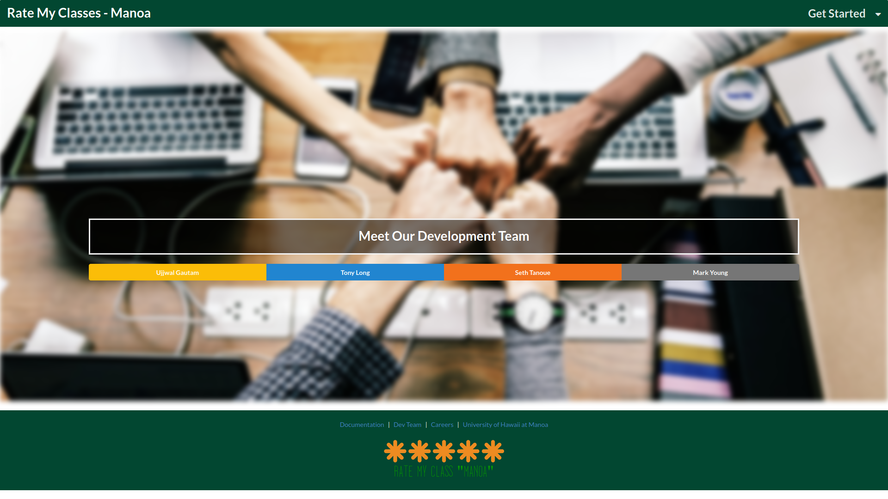

## Table of Contents
- [Overview](#overview)
- [Deployment](#deployment)
- [User Guide](#user-guide)
- [Community Feedback](#community-feedback)
- [Developer Guide](#developer-guide)
- [Continuous Integration](#continuous-integration) 
- [Development History](#development-history)

<br>

## Overview
There isn’t a dedicated website for University of Hawaii specific reviews. For example, [ratemyprofessors.com](https://www.ratemyprofessors.com/) doesn’t come off as personalized or “peer reviewed” because it doesn’t have profiles of people.

In response to this, we're creating an interactive website to rate events and professors, but only for UH Manoa students. This application illustrates various technologies, include:

- [Meteor](https://www.meteor.com/) for Javascript-based implementation of client and server code.
- [React](https://reactjs.org/) for component-based UI implementation and routing.
- [Semantic UI React](https://react.semantic-ui.com/) CSS Framework for UI design.

<br>

## Deployment
A live deployment of Rate My Classes can be found at [https://ratemyclassesmanoa.club](https://ratemyclassesmanoa.club).

<br>

## User Guide
This section provides a walkthrough of the Rate My Classes Manoa user interface and its capabilities.


### Landing Page
The landing page is the first thing the users see upon visiting the root URL to the site.


<br>

### Sign In and Sign Up

Click on the "Get Started" button in upper right corner of the navbar, then select "Sign In" to go to the following page to log in. You must have been previously registered with the system to use this option:


<br>
<br>

Alternatively, you can select “Sign Up” to go to the following page and register as a new user:


<br>

### Profile Page

Once logged in, you will be taken to your profile page. Here you can see the class and professor reviews that you have submitted - both posted reviews and reviews waiting to be approved by the Administrator.


<br>
<br>

To update your profile information, click on the "Edit Profile" button. This will bring you to this page. Here you can use the form to make the necessary changes.



<br>


### Class Review Page

Click on the "Class Reviews" tab to view the class reviews. Use the dropdown panel to pick the class for which you would like to see reviews.


<br>

### Add Class Review Page

To add a class review, click on the "Add Class Review" tab. Completely fill out the form and then click "Submit."


<br>

### Community Events Page

To find out what things are happening at UH Manoa, click on the "Community Events" tab. 


<br>

### Meet the Team Page

In the footer of every page, you can click on the "Dev Team" link. This will take you to the following page:



<br>
<br>

You can click on a name, then a brief description about that person will appear.


<br>

### Careers Page

Also in the footer of each page is the "Careers" link. This will take you to the following page, where you can learn a little about working for Rate My Classes Manoa and view current job openings.


<br>
<br>

## Community Feedback

We are interested in your experience using Rate My Classes! If you would like, please take a couple of minutes to fill out the [Rate My Classes Feedback Form](https://docs.google.com/forms/d/e/1FAIpQLSeVeaA6BbtIEhH--atN_EEg4dQoA27bt7Rgz3st0ZLUwLmciA/viewform?usp=sf_link). It contains only five short questions and will help us understand how to improve the system.

<br>

## Developer Guide

This section provides information of interest to Meteor developers wishing to use this code base as a basis for their own development tasks.

### Installation

First, [install Meteor](https://www.meteor.com/developers/install).

Second, visit the [Rate My Classes github page](https://github.com/Rate-My-Classes-Manoa/rate-my-classes), and click the “Use this template” button to create your own repository initialized with a copy of this application. Alternatively, you can download the sources as a zip file or make a fork of the repo. However you do it, download a copy of the repo to your local computer.

Third, cd into the `rate-my-classes/app` directory and install libraries with:

```css
>> meteor npm install
```

Fourth, run the system with:

```css
>> meteor npm run start
```

If all goes well, the application will appear at [http://localhost:3000](http://localhost:3000).

### Application Design

Rate My Classes is based upon [meteor-application-template-react](https://ics-software-engineering.github.io/meteor-application-template-react/). Please use the videos and documentation at that site to better acquaint yourself with the basic application design of Rate My Classes.

### Data Model

The main data model of RateMyClasses consist of three collections (Professor, Classes, and Profile). The Professor and Classes collections interact with each other though the "join" collection Classes/Professor. The Profile and Classes collection interact with each other though the "join" collection Profile/Classes.


The fields in bold are the primary keys that join each collection.

<br>

## Continuous Integration


Rate My Classes uses [GitHub Actions](https://docs.github.com/en/free-pro-team@latest/actions) to automatically run ESLint and TestCafe each time a commit is made to the default branch. Click [here](https://github.com/Rate-My-Classes-Manoa/rate-my-classes/actions) to see the results of all recent <em>workflows</em>. 

The workflow definition can be viewed in the [.github/workflows/ci.yml](https://github.com/Rate-My-Classes-Manoa/rate-my-classes/blob/master/.github/workflows/ci.yml) file.

<br>

## Development History

The development process for Rate My Classes conformed to [Issue Driven Project Management](http://courses.ics.hawaii.edu/ics314f19/morea/project-management/reading-guidelines-idpm.html) practices. These practices can be summed up as follows:

- Development consists of a sequence of Milestones.

- Each Milestone is specified as a set of tasks.
 
- Each task is described using a GitHub Issue, and is assigned to a single developer to complete.
  
- Tasks should typically consist of work that can be completed in 2-4 days.
   
- The work for each task is accomplished with a git branch named “issue-XX”, where XX is replaced by the issue number.
  
- When a task is complete, its corresponding issue is closed and its corresponding git branch is merged into master.
  
- The state (todo, in progress, complete) of each task for a milestone is managed using a GitHub Project Board.

The following sections document the development history of Rate My Classes.

### Milestone 1: Deploy and Mockup Development

The goal of Milestone 1 was to 
- Deploy the system to [Digital Ocean](https://www.digitalocean.com/),
- Create a landing page, and
- Create mockups for at least four other pages.

Milestone 1 was managed using the [rate-my-classes GitHub Project Board M1](https://github.com/Rate-My-Classes-Manoa/rate-my-classes/projects/1):


<br>

### Milestone 2: Great Improvements

The goal of Milestone 2 was to

- Significantly improve the functionality and quality of the application beyond M1, and
- Significantly improve the software engineering process beyond M1.

Milestone 2 was managed using the [rate-my-classes GitHub Project Board M2](https://github.com/Rate-My-Classes-Manoa/rate-my-classes/projects/2):


<br>

### Milestone 3: Potentially Finish

The goal of Milestone 3 is to

- Significantly improve the functionality of the system from Milestone M2. 
- Find at least five UH community members to try out the system and provide feedback.
- Implement acceptance testing.

Milestone 3 is being managed using the [rate-my-classes GitHub Project Board M3](https://github.com/Rate-My-Classes-Manoa/rate-my-classes/projects/3):


<br>

## Contact Us

Rate My Classes is designed, implemented, and maintained by [Ujjwal Gautam](mailto:ugautam@hawaii.edu), Tony Long, Seth Tanoue, and [Mark Young](mailto:masyoung@hawaii.edu).

<br><br><br><br>


<!--
### Mockup Page Ideas
A user would create a profile using their UH manoa emails to post reviews for certain classes/professors they’ve taken. Users do not need to login to view the reviews however.

For the community board, where people can post upcoming local events, they do not need to login to post events.  

Some of these pages include:

1) Landing page (information about the site). <br>
2) Community event page (lets people post events w/o logging in). <br>
3) Class review page (login required to post). <br>
4) Professor review page (login required to post). <br>
5) Sign in/Sign up page. <br>
6) Admin page.

### Use Case Ideas
The completed page might not need to implement all the above pages, but the end should be:

1) Upon opening website, shows the information, review page, community events and login. <br>
2) User able to sign in or create an account. <br>
3) Admin able to login and edit posts. 

### Beyond the Basics
Some more advanced ideas include:

1) Searching in each page via search bar or alphabetical lists. <br>
2) Starred ratings as opposed to numeric ratings for classes and professors. <br>
3) Users able to flag reviews for the admin to delete. <br>
4) Like reviews.

-->
