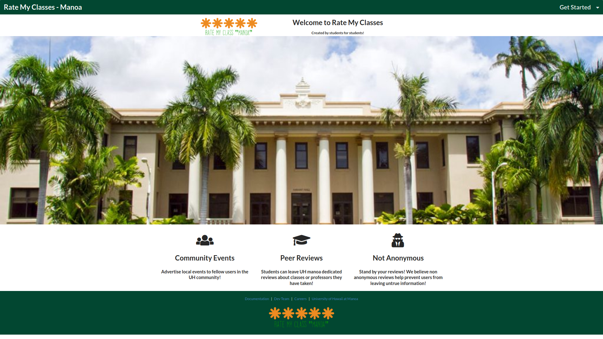

## Overview
The Problem: There isn’t a dedicated website for UH specific reviews, for example, ratemyprofessor doesn’t come off as personalized or “peer reviewed” because it doesn’t really have profiles of people.

The Solution: Create an interactive rating website for events and professors only for UH manoa students for relevant reviews.

## Deployment
A live deployment of Rate My Classes can be found at [https://ratemyclassesmanoa.club](https://ratemyclassesmanoa.club).

## Project Pages 
M1 Project Page: <a href="https://github.com/Rate-My-Classes-Manoa/rate-my-classes/projects/1"/> 
M2 Project Page: <a href="https://github.com/Rate-My-Classes-Manoa/rate-my-classes/projects/2"/>

## User Guide
This section provides a walkthrough of the Rate My Classes Manoa user interface and its capabilities.

### Landing Page
The landing page is the first thing the users see upon visiting the root URL to the site.

### Sign In and Sign Up

Clicking on the "Log In" button in upper right corner of the navbar, will take you to the following page to log in. You must have been previously registered with the system to use this option:

     

Alternatively, you can select “Get Started” to go to the following page and register as a new user:

    

### Meet the Team page

     

     

### Data Model

The main data model of RateMyClasses consist of three collections (Professor, Classes, and Profile). The Professor and Classes collections interact with each other though the "join" collection Classes/Professor. The Profile and Classes collection interact with each other though the "join" collection Profile/Classes.

    

The fields in bold are the primary keys that join each collection.
<!--

### Mockup Page Ideas
A user would create a profile using their UH manoa emails to post reviews for certain classes/professors they’ve taken. Users do not need to login to view the reviews however.

For the community board, where people can post upcoming local events, they do not need to login to post events.  

Some of these pages include:

1) Landing page (information about the site).  
2) Community event page (lets people post events w/o logging in).  
3) Class review page (login required to post).  
4) Professor review page (login required to post).  
5) Sign in/Sign up page.  
6) Admin page.

### Use Case Ideas
The completed page might not need to implement all the above pages, but the end should be:

1) Upon opening website, shows the information, review page, community events and login.  
2) User able to sign in or create an account.  
3) Admin able to login and edit posts. 

### Beyond the Basics
Some more advanced ideas include:

1) Searching in each page via search bar or alphabetical lists.  
2) Starred ratings as opposed to numeric ratings for classes and professors.  
3) Users able to flag reviews for the admin to delete.  
4) Like reviews.

-->
